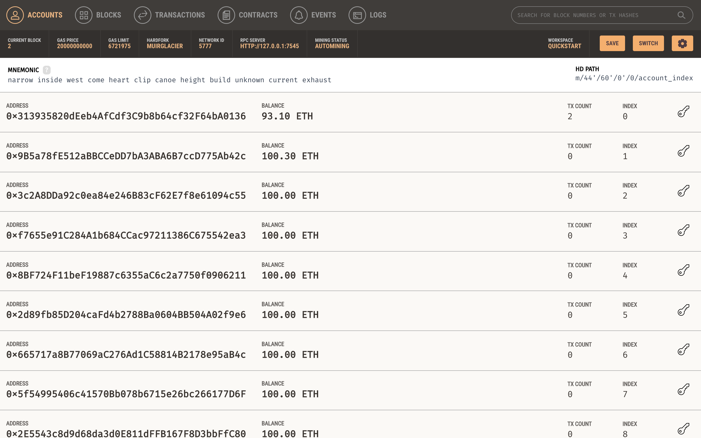
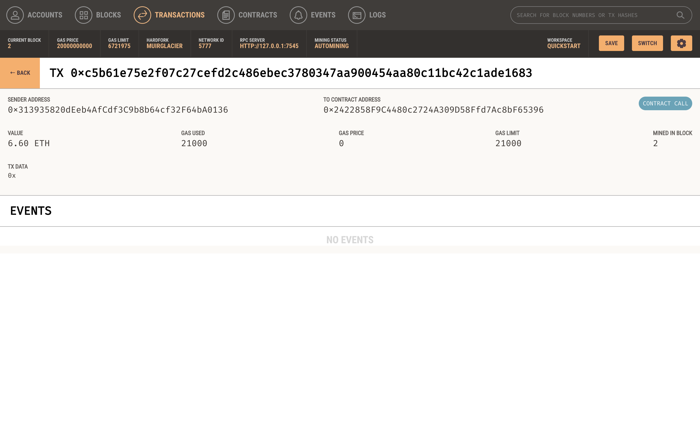

# *Blockchain Application*

The purpose of the FinTech Finder file is to allow the user to find fintech professionals from among a list of candidates, hire them, and pay them.

---

## **Required Technologies**

This application requires `python 3.7.13`, `matplotlib`, `os`, `requests`, `dataclasses`, `dotenv`, `typing`, `bip44`, `web3`, and `streamlit`.

---

## Usage

You can initiate the application in your CLI by navigating to the file and opening it.

---

## Ganache Accounts Tab ##

---

## Ganache Transaction Tab ##

---

## Contributors

Adam Jimenez - FinTech Student

---

## License

2022 edX Bootcamps

